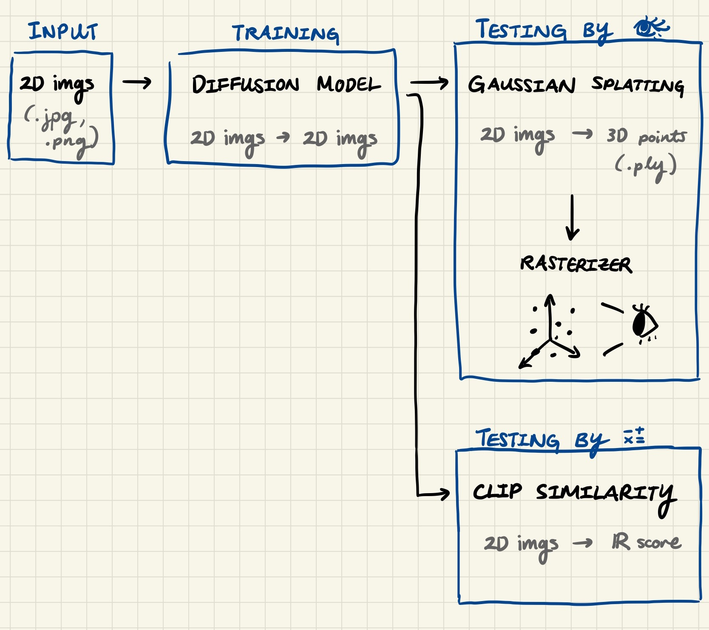

# About

Final project for 11785.

**Group name:** Group 22

**Group Members**
* [Wonsik Shin (wonsiks)](https://github.com/ceteris11)
* [Jessica Ruan (jwruan)](https://github.com/jespiron)
* [Brandon Dong (bjdong)](https://github.com/sad-ish-cat)
* [Aradhya Talan (atalan)](https://github.com/aradhyatalan)

**[TODO] Project Summary:** 3D image edit (shout-out Wonsik for proposing idea and detailed literature review)

[TODO] replace with proposal

# Contributing

Please name branches `your-nickname/name-of-change`. Isn't strict as long as we know who's who

When your PR is approved, please select **[Squash and merge](https://www.lloydatkinson.net/posts/2022/should-you-squash-merge-or-merge-commit/)** from the dropdown. This leads to a much cleaner commit history!

After merging the PR, clean up your branch locally and remotely.
1. Locally: `git branch -D your-nickname/name-of-change`
2. Remotely: deleted automatically since "Automatically delete head branches" is enabled. If it doesn't work, can delete manually by clicking the trash icon next to your branch.

**Where to open PR from?**

If you're making a change that's not related to model training, can make a branch on this repo and open a PR.

If you're contributing a model, please fork this repo and open a PR from your fork.

**Set up:**
1. Fork this repository
2. In your fork, add this repo as a remote `git remote add upstream https://github.com/jespiron/11785-final-project.git`
3. Pull changes with `git fetch upstream -p`. The `-p` prunes any branches that were deleted upstream

Your forked repo will hold models that you're experimenting with and not ready to share with the group. Since I anticipate we'll be experimenting with a lot of models, it'll be cleaner if we isolate models on the repo level, rather than a branch per model or *shudder* a branch with mounds of models.

The reason for this is the more branches we have on remote, the more branches other contributors have to scroll through.

**Workflow:**
1. Train models (see README under `/models`)
2. Test the models (see Testing section for how)
3. Open PR

[TODO] replace with proper UML diagram when finalized, handdrawn is just easier to edit

# Testing

Two ways to test.

## 👁️ Your Eyes

1. Convert 2D images to .ply using [COLMAP](https://colmap.github.io/tutorial.html#quickstart) or other tool
2. Drop .ply file into [splat](splat/) viewer.

[TODO] patch splat viewer s.t. automatically convert 2D images to .ply without going through COLMAP GUI

## CLIP Similarity

Compute pairwise similarity of edited images

[REVIEW] Then get the median similarity score out of all pairwise scores (or some other measure of center)